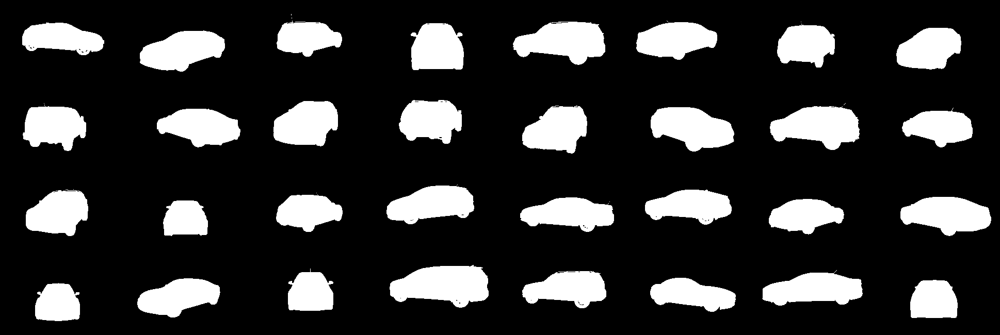
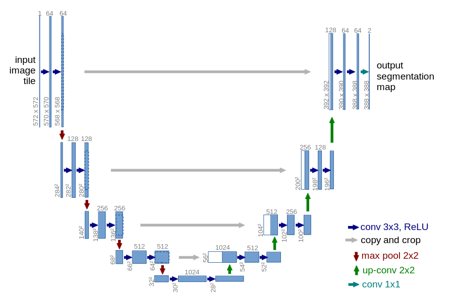

# U-Net Image Segmentation Project

This project implements the U-Net architecture for image segmentation.

## Overview

In this project, I have implemented the U-Net architecture to perform image segmentation. The original U-Net paper did not use batch normalization, but I have added batch normalization after each convolution layer to improve performance.

## Dataset

You can download the dataset using the following link:

https://www.kaggle.com/c/carvana-image-masking-challenge/data

Orignal image size is 1280 * 1918 (height * width) but I have resize to 160*240.
and done data agumentation by rotating, horizontal flip and vertical flip. 

## Architecture

- The U-Net architecture used in this project includes batch normalization after each convolution layer to enhance stability and performance.

- Used BCEWithLogitsLoss since output from the model is logists. 

- To check used dice score which is correct pixels prediction over the total pixeels.

## Results

The output result after segmentation is shown below:

## References

- U-Net: Convolutional Networks for Biomedical Image Segmentation

https://arxiv.org/pdf/1505.04597

 

- data_augumentation.ipynb refer this  to understsand the data agumentation and play with parameters.

- image_generator.ipynb shows the image generation code from raw numbers as input.

- splitter.ipynb to generate train test and development data set